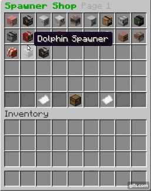

<h1 align="center">mineflayer-GUI</h1>
<div align="center">


<p align="center"><i>A mineflayer plugin enabling for easy management of inventory/chest/etc GUIs</i></p>

<p>(An example of what this plugin can do)</p>
</div>

## Features
- Easy and automated interaction with chest GUIs commonly used on servers
- Automatically navigate through multiple GUI windows with a specified path
- Click items in the hotbar, inventory or a GUI window
- Item display and lore extraction

## Installation
- This plugin uses Node, and as such requires npm to install:
```
npm install mineflayer-gui
```

## Example
```js
const mineflayer = require(`mineflayer`);
const mineflayer_gui = require(`mineflayer-gui`);

const options = {}; // etc.
const bot = mineflayer.createBot(options);
bot.loadPlugin(mineflayer_gui) // load mineflayer-GUI as a plugin. Now methods can be accessed from bot.gui
bot.once(`login`, loginHandler);
bot.on(`windowOpen`, windowHandler);

async function loginHandler() {

  // An example of an item that can be specified whilst performing a window function
  // Of course, this is an example and you likely wouldn't require this amount of detail. (Or maybe you would, who am I to judge)
  let game_selector = {
    display: `Game selection`, // The displayed name of an item
    lore: `Selects a game!`, // The lore of an item
    type: `compass`, // The type of an item
    data: 0, // The metadata of an item
    count: 1, // How much of an item is present
    options: {
      include: true, // Whether or not to check if an item includes a value rather than equating to it (Default: true)
      hotbar: true, // If an item should be selected in the hotbar rather than the inventory (Default: false)
      rightclick: false, // Which mouse button to click with (Default: false)
      clickamount: 1, // How many times to click the item (Default: 1)
      delay: 1000, // How long in milliseconds to wait before clicking an item (Default: 0)
      timeout: 5000, // How long in milliseconds to wait for a window to open (Default: 5000)
    }
  }

  let status = await bot.gui.clickItem(game_selector, `Capture the flag`, `Red`);

  if (status) {
    bot.chat(`Joined CTF!`);
  }

  else {
    bot.chat(`Failed to join CTF!`);
    bot.disconnect();
  }
}

function windowHandler(window) {
  // perhaps you want to log all items whenever a window opens. This can be done with the getItems function:
  let items = await bot.gui.getItems(window, {}); // By specifying an empty object {}, all items will be retrieved as an instance of a prismarineItem.
  
  if (!items) {
    throw new Error(`Couldn't access window! Perhaps it has closed?`);
  }
  
  else {
    for (let item of items) {
      // As item displays and lores are stored in NBT, a function is needed to extract it from their NBT data:
      let display = bot.gui.getDisplay(item);
      let lore = bot.gui.getLore(item);
      console.log(`${item.display}:\nDisplay name: ${display}\nLore: "\n${lore}\n"`);
    }
  }
}
```

## API
### Parameters
#### Path
Can be any of the following:
* An instance of a `PrismarineWindow`
* An item object (See example)
* A string. (Same as `{ display: string }`)

Must obey the following criteria:
* Contain at least ONE item
* PrismarineWindow can only be referenced at the beginning of a path.

#### Item
An object used to specify various traits of an item. (NOT a `PrismarineItem`, don't mix them up!)

#### event
Either "windowOpen" or "windowClose" depending on which you want to listen for.

### Methods
#### bot.gui.clickItem (`...path`)
* Clicks the item specified in a path. Returns an instance of a PrismarineItem or null if nothing was found.

#### bot.gui.getItems (`...path`)
* Retrieves an array of items found in the given path. Returns a PrismarineItem array or null if the window timed out.

#### bot.gui.getWindow (`...path`)
* Retrieves a window from a given path. Returns an instance of a PrismarineWindow or null if nothing was found / window timed out.

#### bot.gui.getDisplay (`PrismarineItem`)
* Gets an item's nbt display. Returns a formatted string.

#### bot.gui.getLore (`PrismarineItem`)
* Gets an item's lore. Returns a formatted string. (New lines expressed as \n)

#### bot.gui.windowEvent (`event`, `ms`)
* Returns a promise of any window opened/closed within the specified timeout, otherwise returns null.
